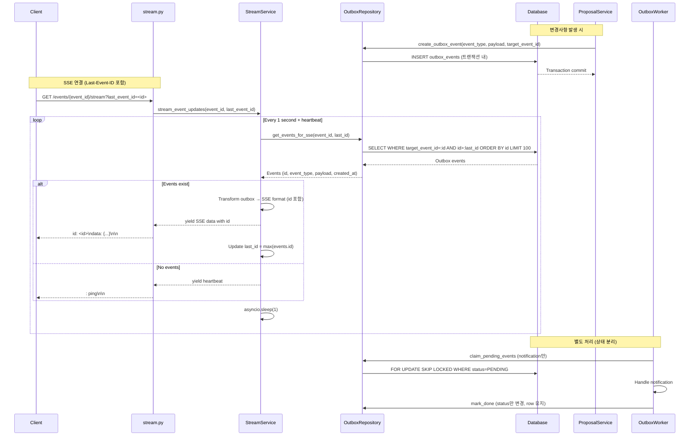

# SSE 실시간 동기화 구현 (Outbox 활용 - 실전 안정화 버전)

## 목표

이벤트의 Proposal 투표 수, 승인/기각 상태 변경, 새로운 Proposal 생성, 코멘트 추가 등을 실시간으로 클라이언트에 전송하는 SSE 엔드포인트 구현. **Outbox 패턴을 활용하여 변경사항 발생 시에만 이벤트를 기록하고, SSE는 Outbox를 읽어서 전송합니다.**

## 핵심 설계 원칙

1. **ID 기반 커서**: `created_at` 대신 `outbox.id`를 커서로 사용하여 누락/중복 방지
2. **정규화된 필터링**: `payload->>'event_id'` 대신 `target_event_id` 컬럼 추가
3. **상태 분리**: Worker 처리 상태(`status`)와 SSE 읽기는 완전 분리
4. **운영 안정성**: heartbeat, retry, backpressure 등 SSE 프로토콜 디테일 적용

## 아키텍처



## 구현 단계

### 1. Outbox 테이블 스키마 확장 (마이그레이션)

**파일**: `migrations/versions/XXX_add_target_event_id_to_outbox.py`

- `target_event_id` 컬럼 추가 (UUID, nullable=False, index=True)
- 기존 데이터 마이그레이션: `payload->>'event_id'`에서 추출하여 채움
- 인덱스 추가: `(target_event_id, id)` 복합 인덱스

**마이그레이션 예시**:

```python
def upgrade():
    op.add_column('outbox_events', sa.Column('target_event_id', UUID(as_uuid=True), nullable=True))
    # 기존 데이터 마이그레이션
    op.execute("""
        UPDATE outbox_events 
        SET target_event_id = (payload->>'event_id')::uuid 
        WHERE payload->>'event_id' IS NOT NULL
    """)
    op.alter_column('outbox_events', 'target_event_id', nullable=False)
    op.create_index('idx_outbox_target_event_id', 'outbox_events', ['target_event_id', 'id'])
```

### 2. Outbox 모델 업데이트

**파일**: `app/models/outbox.py`

- `target_event_id: Mapped[uuid.UUID]` 필드 추가
- 인덱스 정의 업데이트: `Index("idx_outbox_target_event_id", "target_event_id", "id")`

### 3. Outbox 이벤트 타입 확장

**목표**: SSE용 이벤트 타입 추가

기존 이벤트 타입:

- `proposal.approved.v1` (이미 구현)
- `proposal.rejected.v1` (이미 구현)

추가할 이벤트 타입:

- `proposal.created.v1`: Proposal 생성 시
- `proposal.vote.created.v1`: Vote 생성 시
- `proposal.vote.deleted.v1`: Vote 삭제 시
- `comment.created.v1`: Comment 생성 시

### 4. OutboxRepository 업데이트

**파일**: `app/repositories/outbox_repository.py`

#### 4.1 `create_outbox_event` 메서드 수정

- `target_event_id` 파라미터 추가 (필수)
- `create_outbox_event(event_type, payload, target_event_id, ...)` 시그니처 변경

#### 4.2 SSE용 조회 메서드 추가

- `get_events_for_sse(target_event_id, last_id, limit=100)` 메서드:
  - **ID 기반 커서**: `WHERE target_event_id = :target_event_id AND id > :last_id`
  - `ORDER BY id ASC LIMIT :limit`
  - **상태 무관**: `status` 조건 없음 (Worker 처리 상태와 분리)
  - 반환: `list[OutboxEvent]` (id, event_type, payload, created_at 포함)

**구현 예시**:

```python
def get_events_for_sse(
    self,
    target_event_id: UUID,
    last_id: UUID | None,
    limit: int = 100
) -> list[OutboxEvent]:
    """SSE 전용 읽기 메서드 (읽기 전용, DONE 표시하지 않음)"""
    stmt = (
        select(OutboxEvent)
        .where(OutboxEvent.target_event_id == target_event_id)
        .order_by(OutboxEvent.id.asc())
        .limit(limit)
    )
    
    if last_id:
        stmt = stmt.where(OutboxEvent.id > last_id)
    
    result = self.db.execute(stmt)
    return list(result.scalars().all())
```

### 5. Outbox 이벤트 기록 추가

**파일**: `app/services/event/proposal/facade.py`

- `create_assumption_proposal`, `create_criteria_proposal`, `create_conclusion_proposal`:
  - 트랜잭션 내에서 `outbox_repo.create_outbox_event` 호출
  - `event_type="proposal.created.v1"`
  - `target_event_id=event_id` (필수)
  - `payload={proposal_id, proposal_type}` (최소화)

**파일**: `app/services/event/proposal/core/vote_usecase.py`

- `create_vote`, `delete_vote`:
  - 투표 생성/삭제 시 Outbox 이벤트 기록 추가
  - `event_type="proposal.vote.created.v1"` 또는 `"proposal.vote.deleted.v1"`
  - `target_event_id=event_id` (필수)
  - `payload={proposal_id, proposal_type}` (vote_count 제외, 클라이언트가 재조회)

**파일**: `app/services/event/comment_service.py`

- `create_comment`:
  - 코멘트 생성 시 Outbox 이벤트 기록 추가
  - `event_type="comment.created.v1"`
  - `target_event_id=event_id` (필수)
  - `payload={comment_id, criterion_id}` (최소화)

**파일**: `app/services/event/proposal/core/approval_usecase.py`, `auto_approval.py`

- 기존 `create_outbox_event` 호출에 `target_event_id` 파라미터 추가

### 6. 스키마 정의

**파일**: `app/schemas/event/stream.py`

- `EventUpdateResponse`: SSE 응답 스키마
  - `id`: Outbox 이벤트 ID (Last-Event-ID용)
  - `event_type`: Outbox 이벤트 타입
  - `payload`: Outbox payload 그대로 전달 (최소화된 형태)
  - `created_at`: 이벤트 발생 시각

### 7. Stream 서비스 구현

**파일**: `app/services/event/stream_service.py`

- `EventStreamService` 클래스 생성
- `get_event_updates(target_event_id, last_id)` 메서드:
  - `outbox_repo.get_events_for_sse(target_event_id, last_id)` 호출
  - Outbox 이벤트를 SSE 형식으로 변환
  - 반환: `(events: list[dict], last_id: UUID | None)`
- `format_sse_message(event_id, data)` 메서드:
  - SSE 형식으로 변환: `id: <event_id>\ndata: {...}\n\n`
- `format_heartbeat()` 메서드:
  - Heartbeat 메시지: `: ping\n\n`

### 8. SSE 라우터 구현

**파일**: `app/routers/event/stream.py`

- `GET /events/{event_id}/stream` 엔드포인트:
  - 쿼리 파라미터: `last_event_id` (선택, Last-Event-ID 헤더 대체)
  - `StreamingResponse` 사용
  - `event_generator()` async generator 함수:
    - 초기 `last_id = last_event_id or None`
    - `heartbeat_counter = 0` (heartbeat 주기 관리)
    - 루프:
      - `stream_service.get_event_updates(event_id, last_id)` 호출
      - 이벤트가 있으면:
        - 각 이벤트를 SSE 형식으로 yield (`id` 포함)
        - `last_id = max(events.id)` 업데이트
      - 이벤트가 없으면:
        - `heartbeat_counter` 증가
        - 30초마다 heartbeat yield (`: ping\n\n`)
      - `asyncio.sleep(1)` 대기
    - 예외 발생 시:
      - `retry: 5000\n\n` yield
      - 로깅만 하고 조용히 backoff (5초 대기)
  - 헤더 설정:
    - `Content-Type: text/event-stream`
    - `Cache-Control: no-cache`
    - `Connection: keep-alive`
    - `X-Accel-Buffering: no` (nginx 프록시 버퍼링 방지)
  - 인증: `get_current_user` dependency 사용
  - 멤버십 검증: ACCEPTED 멤버십만 접근 가능
  - 연결 해제 감지: 클라이언트 연결 종료 시 자동 정리

### 9. 라우터 등록

**파일**: `app/routers/event/__init__.py`

- `stream` 모듈 import 및 라우터 등록

### 10. 의존성 주입 설정

**파일**: `app/dependencies/services.py`

- `get_stream_service` 함수 추가

## 주요 고려사항

### 1. ID 기반 커서 (우선순위 1)

- **문제**: `created_at > since` + `datetime.now()` 조합은 경계에서 누락/중복 발생 가능
- **해결**: Outbox `id` (단조 증가)를 커서로 사용
  - 조회: `WHERE target_event_id = :id AND id > :last_id ORDER BY id ASC`
  - SSE 메시지에 `id: <outbox_id>` 포함
  - 클라이언트는 `Last-Event-ID` 헤더로 재연결
- `created_at`는 표시용으로만 사용

### 2. target_event_id 정규화 (우선순위 2)

- **문제**: `payload->>'event_id'` 필터링은 데이터 커지면 비용 증가, 인덱스 복잡
- **해결**: `target_event_id` 컬럼 추가 (마이그레이션 1회)
  - 인덱스: `(target_event_id, id)` 복합 인덱스
  - 단순하고 효율적인 필터링

### 3. Worker와 SSE 상태 분리

- **Worker 처리 상태**: `status = PENDING/DONE` (알림 처리용)
- **SSE 읽기**: 상태 조건 없음, `event_type`, `target_event_id`, `id` 커서만 사용
- **보관 정책 분리**:
  - Worker는 `mark_done`만 수행 (row 유지)
  - 별도 cron/maintenance로 "N일 지난 outbox 삭제" 정책 적용
  - SSE 재연결 window (5~30분) 동안은 유지 보장

### 4. 이벤트 타입/페이로드 최소화

- **원칙**: "프론트가 무엇을 해야 하는지" 기준으로 최소화
- **최소 payload**: `{proposal_id, proposal_type}` 또는 `{comment_id, criterion_id}`
- **vote_count 제외**: 클라이언트가 해당 proposal만 재조회하도록
- **status 변경 이벤트**: `proposal.approved.v1`, `proposal.rejected.v1`에만 status 포함

### 5. SSE 프로토콜 디테일 (운영 필수)

#### A. Heartbeat (핑)

- 프록시/로드밸런서 idle connection 방지
- 30초마다 `: ping\n\n` comment 이벤트 전송

#### B. Retry 지시자 + 에러 처리

- `retry: 5000\n\n` 헤더 전송
- 예외 발생 시 조용히 backoff (5초 대기)
- 빈번한 에러 메시지 전송 자제

#### C. 배치 제한과 역압(backpressure)

- `limit=100`으로 배치 제한
- 이벤트가 100개를 넘으면 다음 루프에서 계속 전송
- 한 커넥션이 느려지면 메모리/큐 쌓임 방지 설계

### 6. 성능 고려사항

- **인덱스**: `(target_event_id, id)` 복합 인덱스 필수
- **쿼리 최적화**: ID 기반 커서로 인덱스 스캔 효율적
- **확장성**: 동접 증가 시에도 `(연결 수 × 초당 1쿼리)` 수준 유지
- **향후 확장**: Redis Pub/Sub로 전환 가능한 구조 (Outbox 이벤트를 Redis로 푸시)

### 7. 보안 및 권한

- 인증: `get_current_user` dependency 사용
- 멤버십 검증: ACCEPTED 멤버십만 접근 가능
- 권한 변경 처리: 스트림 도중 멤버십이 REJECTED로 변경되면 다음 요청부터 차단

## 테스트 포인트

### 기본 기능 테스트

1. SSE 연결 정상 동작 확인
2. Proposal 생성 시 Outbox 이벤트 기록 및 SSE 전송 확인
3. Vote 추가/삭제 시 Outbox 이벤트 기록 및 SSE 전송 확인
4. Proposal 승인 시 Outbox 이벤트 기록 및 SSE 전송 확인
5. Comment 생성 시 Outbox 이벤트 기록 및 SSE 전송 확인

### 실전 안정성 테스트 (필수)

1. **재연결 테스트**: 

   - `Last-Event-ID` 헤더로 끊겼다 붙었을 때 누락/중복 없는지 확인
   - ID 기반 커서로 정확한 재개 확인

2. **동시간 이벤트 테스트**:

   - 동일한 `created_at`에 여러 row가 생겨도 순서/누락 없는지 확인
   - 빠른 연속 insert에서도 ID 순서 보장 확인

3. **정리 정책 테스트**:

   - Outbox cleanup이 돌아도 최근 window(5~30분)는 보장되는지 확인
   - Worker가 `mark_done`해도 SSE가 읽을 수 있는지 확인

4. **권한 변경 테스트**:

   - 스트림 도중 멤버십이 REJECTED로 바뀌면 다음 요청부터 막히는지 확인
   - 기존 연결은 유지되지만 새 이벤트는 차단되는지 확인

5. **다중 인스턴스 테스트**:

   - 서버 2대에서 동일 `event_id` 스트림이 동일하게 동작하는지 확인
   - ID 기반 커서로 인스턴스 간 일관성 보장 확인

6. **Heartbeat 테스트**:

   - 30초마다 heartbeat가 전송되는지 확인
   - 프록시/로드밸런서 idle timeout 방지 확인

7. **Backpressure 테스트**:

   - 이벤트가 100개를 넘어도 순차적으로 전송되는지 확인
   - 느린 클라이언트 연결에서 메모리 누수 없는지 확인

8. **에러 복구 테스트**:

   - DB 연결 끊김 시 `retry` 헤더 전송 및 재연결 확인
   - 예외 발생 시 조용히 backoff하는지 확인

## 마이그레이션 체크리스트

- [ ] `target_event_id` 컬럼 추가 마이그레이션 작성
- [ ] 기존 데이터 마이그레이션 (payload에서 추출)
- [ ] `(target_event_id, id)` 복합 인덱스 추가
- [ ] Outbox 모델에 `target_event_id` 필드 추가
- [ ] `create_outbox_event` 시그니처 변경 (target_event_id 필수)
- [ ] 모든 `create_outbox_event` 호출부에 `target_event_id` 추가

## 구현 체크리스트

- [ ] Outbox 이벤트 타입 확장 (proposal.created, vote.created/deleted, comment.created)
- [ ] OutboxRepository에 `get_events_for_sse` 메서드 추가 (ID 기반 커서)
- [ ] Stream 서비스 구현 (ID 기반 커서, heartbeat, retry)
- [ ] SSE 라우터 구현 (Last-Event-ID 지원, heartbeat, 에러 처리)
- [ ] 각 서비스에서 Outbox 이벤트 기록 추가 (target_event_id 포함)
- [ ] 라우터 등록 및 의존성 주입 설정
- [ ] 실전 안정성 테스트 수행

## 결론

이 설계는 다음을 보장합니다:

1. **정합성**: ID 기반 커서로 누락/중복 방지
2. **성능**: 정규화된 `target_event_id` + 복합 인덱스로 효율적 조회
3. **운영 안정성**: heartbeat, retry, backpressure 등 SSE 프로토콜 디테일 적용
4. **확장성**: Redis Pub/Sub로 전환 가능한 구조
5. **신뢰성**: Worker와 SSE 상태 분리, 보관 정책 분리